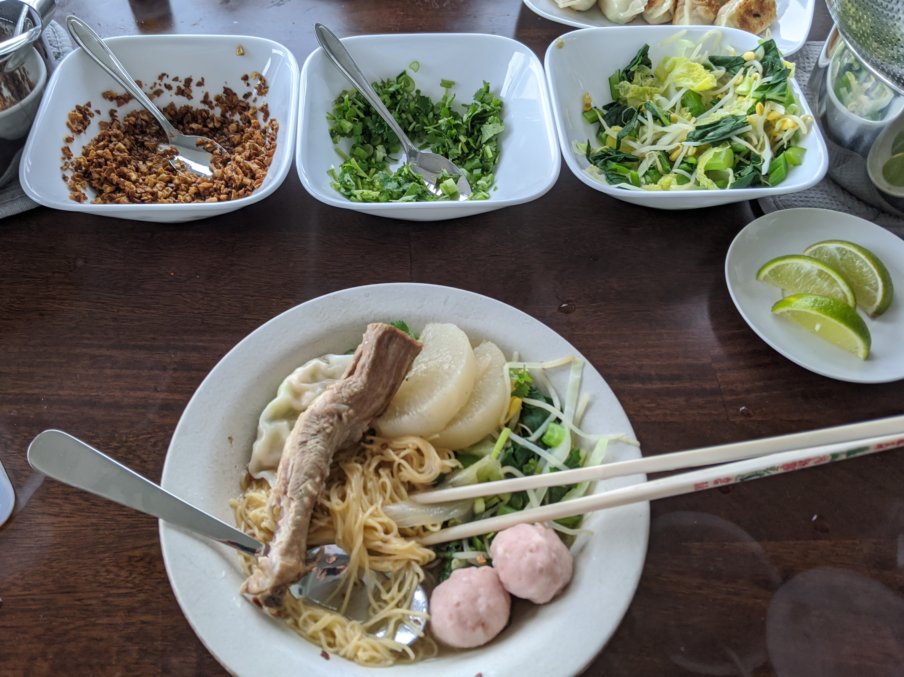
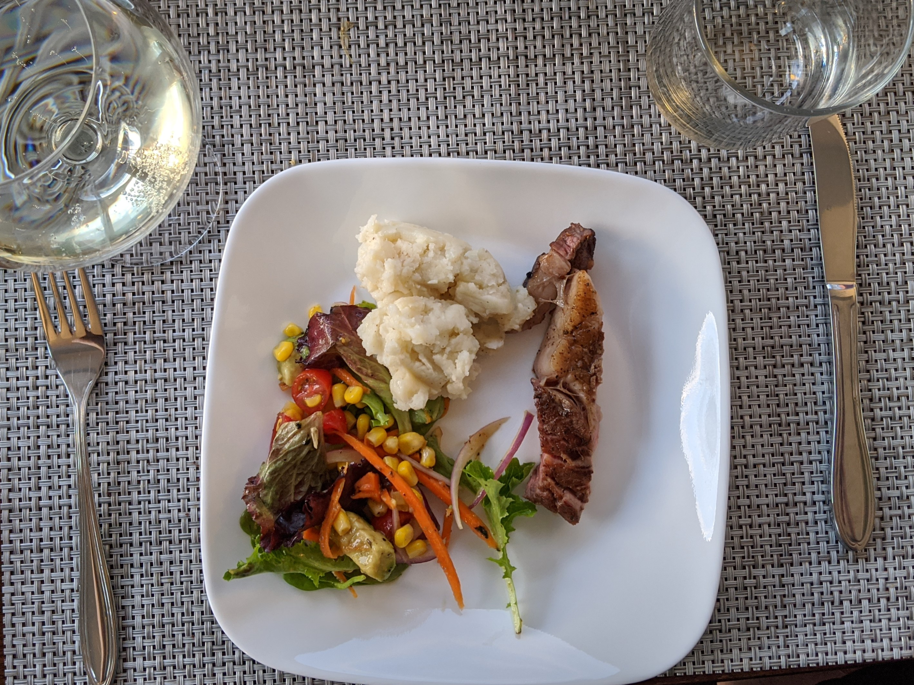
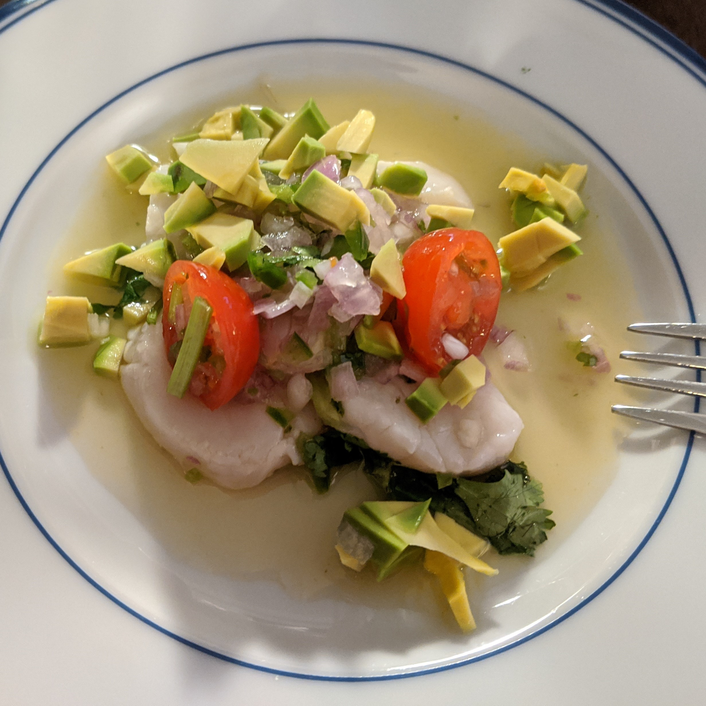
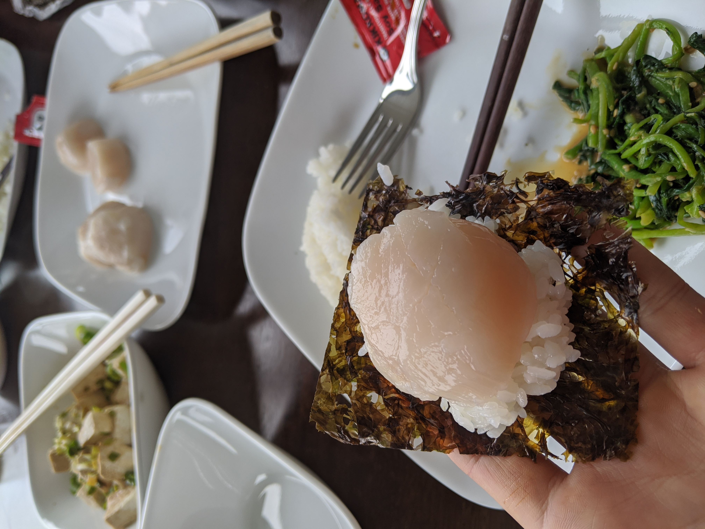
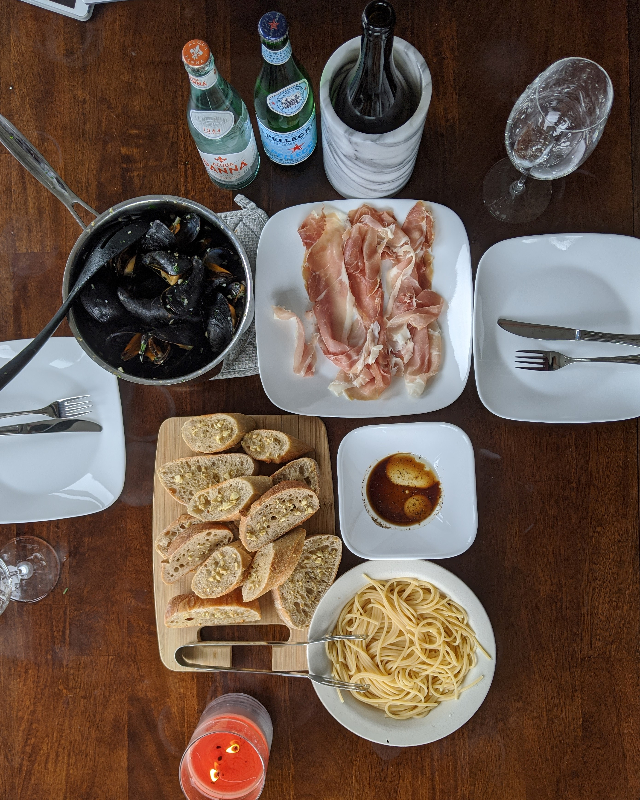
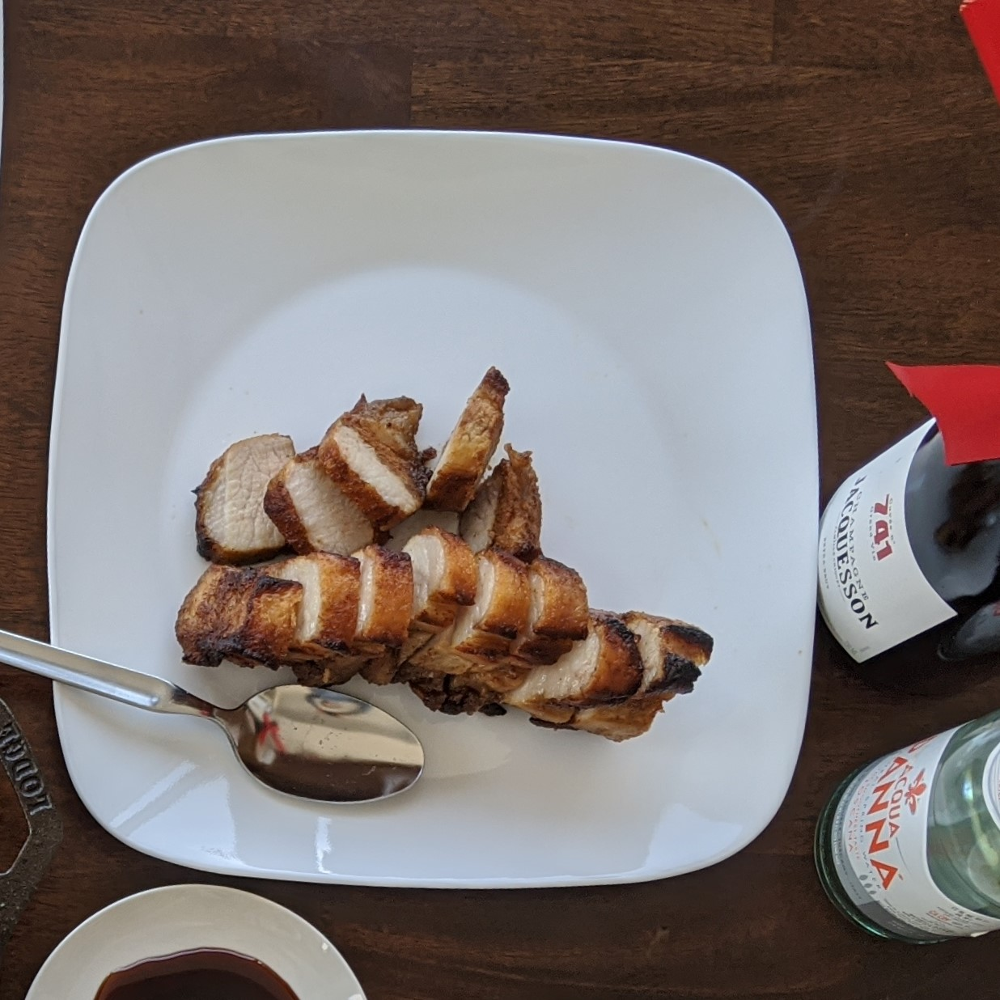

## Quarantine Recipes

During lockdown I tried a few different recipes. Those that I appreciated most were easy to execute, and used ingredients that you would generally use for other dishes (they also tasted good, of course). 

**Easy to execute (complexity)**:  Some recipes are simple in the cooking phase, but complex in the preparation phase (e.g. rolling kimbap with the right volume of rice). Others are easy to prep for but leave little room for you to screw up when frying (e.g. leave your steak on the grill for too long and you've got leather for dinner).

**Ingredient generality**: Nobody wants to buy groceries that can only cook you one dish.

I've ranked the dishes successfully done by High Ingredient Generality and Low Executional Complexity: 

Name | Cuisine Type | Complexity | Ingredient Generality |
---------|--------|------------| ----
[Pad Krapow](#krapow) | Thai | Low | High
[Spaghetti Bolognese](#bolognese) | American? Italian? | Low | High
[Sukiyaki](#sukiyaki) | Japanese | Low | Medium
[Gyu Don] (#gyudon) | Japanese | Low | High
[Suki Nam / Suki Heng*](#suki) | Thai | High | Medium
[Japchae](#japchae) | Korean | High | Medium
[Sous Vide Steak & Mashed Potatoes](#steak) | Hmm... | Low | Low-Mid
[Scallop Ceviche](#ceviche) | Peruvian | Low | Low
[Garlic Butter Mussels](#mussels) | Italian | Low | Low
[Kimbap](#kimbap) | Korean | High | Low
[Roast Pork Belly](#porkbelly) | Chinese | High | Low

---

## Pad Krapow {#krapow}

## Spaghetti Bolognese {#bolognese}
## Sukiyaki {#sukiyaki}
## Gyu Don {#gyudon}
## Suki Nam / Suki Heng {#suki}

{:class="picture"}

## Japchae {#japchae}

{:class="picture"}

## Sous Vide Steak & Mashed Potatoes {#steak}

{:class="picture"}

{:class="picture"}

## Scallop Ceviche {#ceviche}

{:class="picture"}

{:class="picture"}

## Garlic Butter Mussels {#mussels}

{:class="picture"}

## Kimbap {#kimbap}

{:class="picture"}

## Roast Pork Belly {#porkbelly}

{:class="picture"}